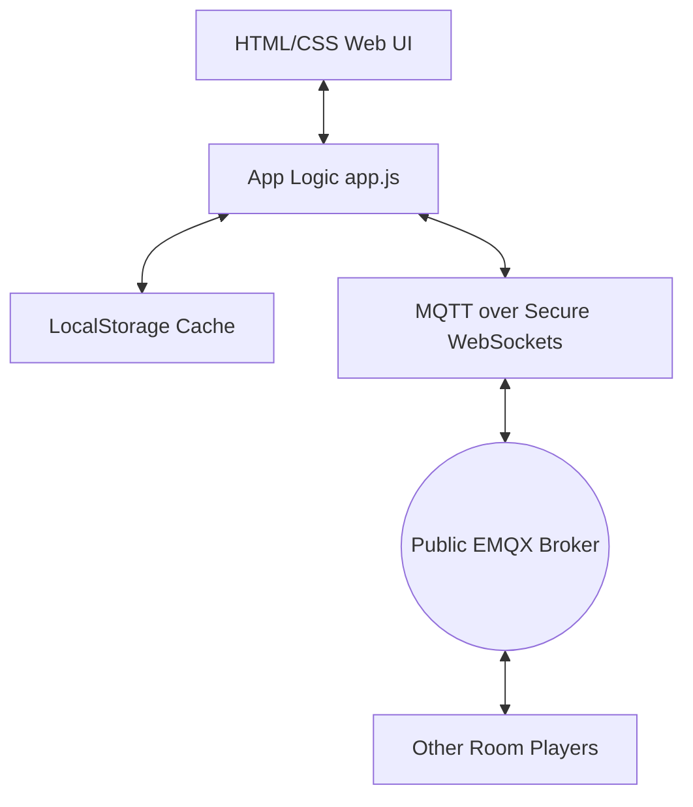

# Implementation Plan - Planning Poker Web App

This plan outlines the architecture, layout, styling, and real-time syncing mechanism for a client-side Planning Poker application matching the look and feel of `https://app.planitpoker.com/`. It will be optimized for hosting on **GitHub Pages** (fully static, zero-build, single-page routing) and will feature robust, serverless collaboration.

---

## Technical Architecture

To ensure 100% compatibility with GitHub Pages (which only hosts static assets), we will build a **Single Page Application (SPA) using HTML5, Vanilla CSS, and Modern JavaScript**. 

### Real-Time Syncing (No Backend Required)
Collaboration is key for planning poker. To make it work in real-time on a static host without a custom backend:
1. We will use **MQTT over WebSockets** connecting to a public MQTT broker (`wss://broker.emqx.io:8084/mqtt` with fallback to `wss://test.mosquitto.org:8081/mqtt`).
2. **Topic Protocol**: Rooms will communicate on a unique topic: `antigravity-poker/rooms/{roomId}`.
3. **Data Security & Privacy**: To prevent room collisions and sniffing:
   - Room IDs will be generated as high-entropy random strings, or entered by the user.
   - Message payloads will be structured JSON containing client-side state events (pings, votes, clear events, flip events).
   - Vote values are *not* broadcast to others during the voting phase. Instead, clients only broadcast `{ hasVoted: true }`. When the cards are flipped, each client publishes their actual vote, preventing inspection of the browser network tab to see other people's estimates.

### Cache & Client State
1. **User Names & History**: Saved in `localStorage` under `poker_user_profile` (storing `username` and `avatar_index`) and `poker_room_history` (list of recent rooms).
2. **Auto-Join**: If a user visits a URL with a room hash (e.g. `index.html#/room/room-id-123`), the app reads the hash, prompts for a nickname if not stored, and connects them automatically.

---

## Design System & Aesthetics (Rich & Premium)

We will implement a premium visual layer using **Vanilla CSS**:
* **Theme**: Light/Dark adaptive mode with a smooth toggle switch.
* **Palette**: 
  - *Light Mode*: Soft slate-blue backgrounds (`#eaeff3`), vibrant blue primary colors (`#4292e7`), frosted glass panels (`rgba(255,255,255,0.75)` with `backdrop-filter: blur(10px)`).
  - *Dark Mode*: Deep space slate (`#0f172a`), deep container fills (`rgba(30, 41, 59, 0.7)`), and neon blue/violet borders (`#38bdf8`, `#8b5cf6`).
* **Micro-Animations**:
  - 3D card lift and tilt on hover.
  - Card flipping animation (3D rotate Y) when votes are revealed.
  - Pulse effects on active voting states.
  - Sparkle confetti explosion using `canvas-confetti` when there is a consensus vote.

---

## Proposed Changes

We will create the following files in the project workspace root:

### `[NEW]` [index.html](file:///c:/Users/Nipun/Documents/planning/index.html)
The main entry point. It will contain:
- Semantic layout: Welcome/join container, Poker board screen, and Sidebar.
- CDNs for external libraries:
  - Font: **Outfit** from Google Fonts.
  - Icons: **Lucide Icons** (using standard SVG or unpkg package).
  - WebSockets: **MQTT.js** (for serverless sync).
  - Animation: **canvas-confetti** (for consensus celebration).

### `[NEW]` [style.css](file:///c:/Users/Nipun/Documents/planning/style.css)
The style sheets containing:
- CSS variables for light/dark themes.
- Layouts (CSS Grid for card deck, Flexbox for player list, responsive sidebar).
- Card design including card suits, border overlays, back design patterns, and 3D flip classes.
- Soft custom scrollbars, glassmorphism blur wrappers, and adaptive inputs.

### `[NEW]` [app.js](file:///c:/Users/Nipun/Documents/planning/app.js)
The core application script:
- State Object: `roomName`, `storyName`, `username`, `userId`, `players` (map of active users), `currentVote`, `gameState` (`voting` or `revealed`), `timerSeconds`.
- Connection helper: Initializes MQTT client, handles automatic reconnects, subscribes to room channels.
- Peer sync logic: 
  - Periodic heartbeat (every 5 seconds) to maintain presence.
  - Heartbeat timeout handling (removes players after 12 seconds of silence).
  - Voting, flipping, clearing, and timer synchronization.
- UI Renderers: Dynamic template rendering for player lists, card grids, voting statistics, and action states.

---

## User Review Required

> [!IMPORTANT]
> **Collaborative Controls**: Anyone in the room will have access to the action buttons (Flip, Clear, Reset Timer). This follows a collaborative "trust-based" design which is typical for Agile planning poker tools. We will add a visual indicator showing who performed the action (e.g. "nip cleared the votes").
> Let us know if you prefer to restrict actions to a designated "Host/Room Creator" instead.

> [!TIP]
> **Confetti on Consensus**: If all voting players agree on the same value (e.g., all vote "5"), a confetti celebration will trigger to make the sprint estimation session more engaging.

---

## Verification Plan

### Automated Verification
- Code quality check using standard syntax validation.
- Verification of standard WebSockets connectivity on mock network profiles.

### Manual Verification
1. **Open File Directly**: Open `index.html` locally in a browser to verify the Welcome screen.
2. **Room Creation & Join**: Create a room, write down the name, and check if it is saved in local history.
3. **Multi-device Testing**: Open the generated invite link in a separate browser tab or window (simulating player B) and check if:
   - Player B appears in Player A's player list.
   - Player A and B can see each other's voting status (e.g. "nip has voted").
   - Flipping cards reveals estimates on both screens simultaneously.
   - Resetting/clearing/skipping updates the state across all screens.
4. **Theme Toggle**: Test light/dark mode and confirm formatting across both settings.
5. **Storage Check**: Refresh the page and confirm the username is remembered, and recent rooms are populated in the welcome menu.
